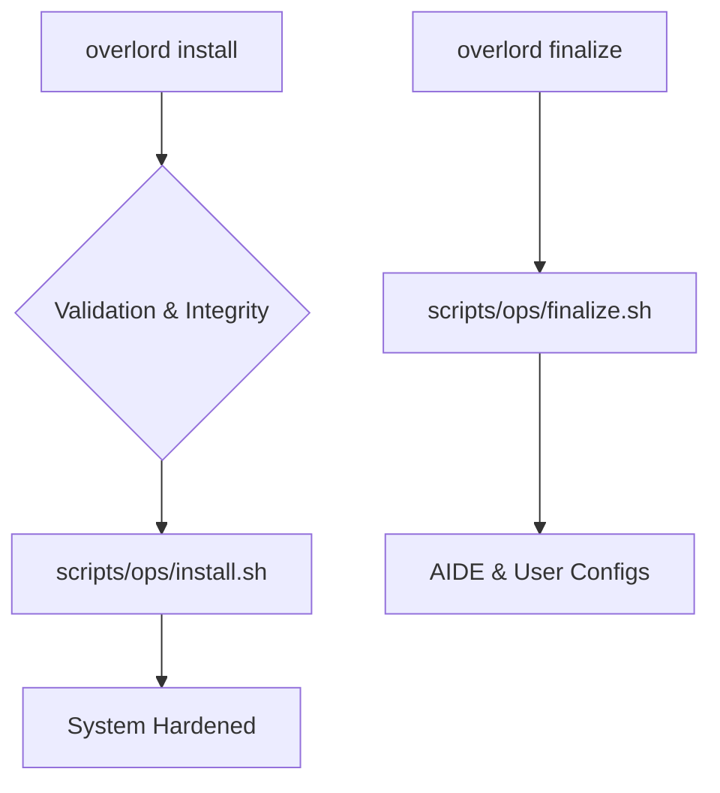

# Chimera Guardian Arch 👑

  



> **v51 (Chimera Edition)**: Un framework SecureOps professionale per il deployment di un ambiente Arch Linux intelligente, manutenibile e potenziato.

Questo progetto è un framework di automazione post-installazione che trasforma un sistema Arch Linux minimale e crittografato in una piattaforma SecureOps completa. È progettato per professionisti della sicurezza, sviluppatori e utenti attenti alla privacy che richiedono un livello eccezionale di controllo sul proprio ambiente digitale.

---
## 1.0 Executive Summary

Chimera Guardian Arch provides a robust automation layer designed to provision and maintain a hardened Arch Linux workstation. Operating on top of a user-installed, LUKS-encrypted minimal base, this framework programmatically deploys a comprehensive suite of security controls, real-time monitoring capabilities (LKRG, Falco, AIDE), advanced anonymity features (Tor/I2P integration, DNSCrypt), and compartmentalized workflows through virtualization.

Engineered for cybersecurity practitioners, secure software developers, and individuals requiring high-assurance privacy, Chimera delivers a fully configured Hyprland desktop environment alongside a curated stack of professional development and security assessment tools. The framework adheres to a modular, operator-centric architecture, emphasizing maintainability, resilience, and explicit user control over critical security functions. It yields a powerful, customized platform optimized for demanding digital operations.

---

## 🚀 Quick Installation

This framework **requires** a minimal Arch Linux base system installed on a **LUKS-encrypted** root partition.

1.  **Clone the Repository:**
    ```bash
    git clone https://URL_OF_YOUR_REPO/chimera-guardian-arch.git
    cd chimera-guardian-arch
    ```
2.  **Configure Environment:** Copy `.env.example` to `.env` and **edit it** to set your `CHIMERA_USER` and preferred `THEME`.
    ```bash
    cp .env.example .env
    nano .env
    ```
3.  **Run the Main Installation:** This command installs all packages and performs the base system setup.
    ```bash
    make install
    ```
4.  **Perform Manual Steps & Reboot:** Follow the on-screen instructions precisely to configure your Bootloader (GRUB) and `fstab`. Then, reboot the system.
5.  **Finalize the System:** After rebooting and logging in, navigate back to the project directory and run the finalization command. This initializes AIDE and links your configuration files.
    ```bash
    make finalize
    ```
Your Chimera Guardian Arch system is now fully deployed.

---

## ✨ Core Features

* **Kernel-Level Defense**: Utilizes `linux-hardened` and the **LKRG** module for real-time exploit protection.
* **System Integrity & Firewalling**: Implements **AIDE** for integrity monitoring, `UFW` (ingress) + **OpenSnitch** (egress) for comprehensive network control.
* **Real-time Auditing**: Includes **Falco** + **auditd** for system call monitoring with custom rulesets.
* **Multi-Level Security Posture**: A custom CLI, `guardian-cli` (wrapped by `gdn-*` functions), allows you to instantly switch between operational security profiles defined in YAML (`standard`, `secure`, `paranoid`, `cyberlab`).
* **Advanced Anonymity Suite**: Pre-configured access to both the **Tor** and **I2P** anonymity networks.
* **Encrypted DNS**: System-wide DNS privacy enforced via **DNSCrypt-proxy**.
* **Compartmentalization via Virtualization**: Includes pre-configured profiles (`.conf`) and a universal script (`create-vm.sh`) to instantly deploy isolated Virtual Machines (`disposable`, `work`, `tor`, `cyberlab`).
* **Professional Software Suite**: Pre-installs and configures Neovim (Lua), VS Code, Docker, Postman, Wireshark, KeePassXC, SearchSploit, Metasploit, Burp Suite, OWASP ZAP, Aircrack-ng, Autopsy, and more.
* **Prestige Desktop Environment**: A fully configured **Hyprland** desktop with dynamic theming (`dracula`, `nord`), custom shortcuts, Powerlevel10k prompt, and a suite of "Quality of Life" apps.
* **Automated Maintenance**: Robust `update` function handles OS, AUR, Exploit-DB updates and orphan cleanup, with automatic AIDE baseline regeneration via hooks. Includes versioned backups with encryption support.
* **Professional Framework**: Managed via a central `Makefile`. Features modular scripts with robust error handling (`trap rollback`), centralized logging, script integrity checks (`checksums.txt`), a CI/CD pipeline, and comprehensive documentation.

---

## 🛠️ Main Commands (via Makefile)

| Command | Description |
| :--- | :--- |
| `make install` | Runs the main system installation (requires sudo). |
| `make finalize` | Runs the post-reboot finalization (requires sudo). |
| `make link` | (Re)creates symbolic links for all configuration files. |
| `make backup` | Creates a versioned, compressed snapshot of your `~/.config` directory. |
| `make update` | Securely updates the entire system (OS, AUR, Exploit-DB). |
| `make healthcheck`| Runs a full system security and status check (requires sudo). |
| `make theme=<name>`| Applies a different theme (e.g., `make theme=nord`). |
| `make rollback` | Restores configurations from the most recent backup. |
| `make logs` | Tails the main installation log file. |
| `make checksums` | Regenerates the script integrity checksums file. |
| `make tui` | Launches the interactive TUI Control Center. |

*(Note: Daily use commands defined in `zsh_functions`, such as `gdn-paranoid`, `aide-check`, `vms`, `safe-browser`, are available directly in your shell after `make finalize`)*

---

## 🧩 Component Overview

| Component | Config Path | Management Method |
| :--- | :--- | :--- |
| Window Manager | `config/hypr/` | Hyprland (modular) |
| Terminal | `themes/[THEME]/kitty.conf` | Kitty |
| Status Bar | `themes/[THEME]/waybar.css` | Waybar |
| Code Editor | `config/nvim/` | Lua (modular) |
| App Launcher | `themes/[THEME]/rofi.rasi` | Rofi |
| Shell | `zsh_functions`, `.p10k.zsh` | Zsh / Powerlevel10k |
| Security Profiles| `config/guardian/profiles/` | YAML / `guardian-cli`|
| VM Profiles | `vm-profiles/*.conf` | Bash / `create-vm` |

---

## ⚠️ Disclaimer

This framework installs powerful security and network analysis tools sourced from official Arch repositories, the AUR, and the BlackArch repository. The use of these tools is your sole responsibility. Always act ethically and ensure you have explicit, written permission before using them on any network or system that is not your own.

---

## ⚖️ License

This project is released under the MIT License. See the `LICENSE` file for details.