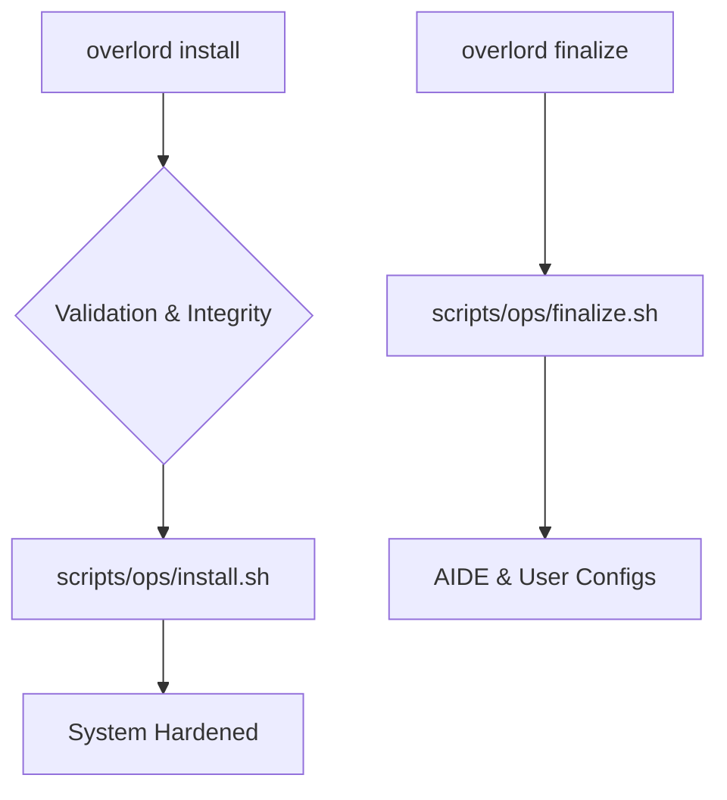

# Chimera Guardian Arch 👑

  



> **v38 (Overlord Edition)**: Un framework SecureOps professionale per il deployment di un ambiente Arch Linux intelligente, manutenibile e potenziato.

Questo progetto è un framework di automazione post-installazione che trasforma un sistema Arch Linux minimale e crittografato in una piattaforma SecureOps completa. È progettato per professionisti della sicurezza, sviluppatori e utenti attenti alla privacy che richiedono un livello eccezionale di controllo sul proprio ambiente digitale.

---

## 🚀 Avvio Rapido

Assicurati di aver configurato prima il file `.env`.

1.  **Clona il Repository:**
    ```bash
    git clone https://URL_DEL_TUO_REPO/chimera-guardian-arch.git
    cd chimera-guardian-arch
    chmod +x overlord
    ```
2.  **Esegui l'Installazione Completa:**
    ```bash
    sudo ./overlord install
    ```
3.  **Esegui i Passaggi Manuali & Riavvia.** Segui le istruzioni a schermo per il Bootloader e `fstab`.
4.  **Finalizza il Sistema:**
    ```bash
    sudo ./overlord finalize
    ```
Il tuo sistema è ora completamente deployato.

---

## ✨ Funzionalità Principali

* **Difesa a Livello Kernel**: Utilizza `linux-hardened` e il modulo **LKRG** per protezione in tempo reale contro exploit.
* **Integrità di Sistema & Firewalling**: Implementa **AIDE** per monitoraggio integrità, `UFW` + **OpenSnitch** per controllo di rete.
* **Profili di Sicurezza Multi-Livello**: Utility `guardian-cli` per passare istantaneamente tra **tre livelli operativi** (`standard`, `secure`, `paranoid`).
* **Suite Anonimato Avanzata**: Accesso pre-configurato alle reti **Tor** e **I2P**.
* **Compartimentazione via Virtualizzazione**: Include profili per deployare VM isolate (`disposable`, `work`, `tor-vm`).
* **Suite Software Professionale**: Pre-installa e configura Neovim (Lua), VS Code, Docker, Postman, Wireshark, KeePassXC e altro.
* **Ambiente Desktop Prestigioso**: Un desktop **Hyprland** completamente configurato con interfaccia tematizzabile, scorciatoie personalizzate e app "Quality of Life".

---

## 🛠️ Il Command Center Overlord

Tutta la gestione del sistema è ora centralizzata tramite il CLI `overlord`. Esegui `overlord help` per una lista completa dei comandi.

| Comando                | Descrizione                                             |
| :--------------------- | :------------------------------------------------------ |
| `sudo overlord install`| Esegue l'installazione principale del sistema.          |
| `sudo overlord finalize`| Finalizza la configurazione dopo il riavvio.           |
| `overlord update`      | Aggiorna in modo sicuro l'intero sistema.               |
| `overlord backup`      | Crea uno snapshot sicuro delle tue configurazioni.       |
| `overlord status`      | Esegue un controllo completo di salute e sicurezza.      |
| `overlord tui`         | Lancia il TUI Control Center interattivo.               |

---

## 🧩 Panoramica Componenti

| Componente       | Percorso Config              | Gestione           |
| :--------------- | :--------------------------- | :----------------- |
| Window Manager   | `config/hypr/`               | Hyprland (modulare)|
| Terminale        | `themes/[TEMA]/kitty.conf`   | Kitty              |
| Status Bar       | `themes/[TEMA]/waybar.css`   | Waybar             |
| Editor di Codice | `config/nvim/`               | Lua (modulare)     |
| App Launcher     | `themes/[TEMA]/rofi.rasi`    | Rofi               |
| Shell            | `zsh_functions`              | Zsh                |

---

## Disclaimer

Questo framework installa potenti strumenti di sicurezza e analisi di rete. L'uso di questi strumenti è di tua esclusiva responsabilità. Agisci sempre eticamente e assicurati di avere il permesso esplicito e scritto prima di usarli su qualsiasi rete o sistema che non sia il tuo.

---

## ⚖️ Licenza

Questo progetto è rilasciato sotto la Licenza MIT.