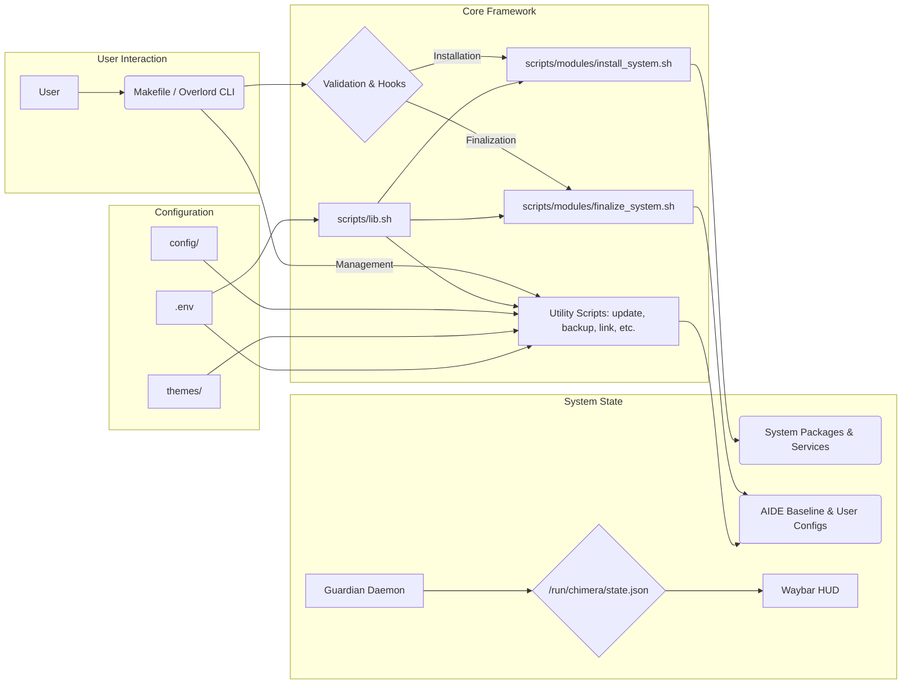

# Chimera Guardian Arch: System Architecture

## 1. Overview

Chimera Guardian Arch is a **post-installation automation framework** designed to overlay a robust SecureOps environment onto a minimal, encrypted Arch Linux base. It is architected to be modular, maintainable, and operator-centric, providing a high level of security without sacrificing the flexibility inherent to Arch Linux.

The framework manages system hardening, application deployment, configuration linking, real-time monitoring, and compartmentalization through a unified set of scripts orchestrated by a central `Makefile` and a user-facing CLI (`overlord`).

## 2. Core Design Principles

1.  **Defense-in-Depth:** Multiple, overlapping security controls are implemented across all system layers.
2.  **Operator Supremacy:** The framework provides intelligence and automation but reserves critical decisions for the human operator.
3.  **Compartmentalization:** Workflows are isolated using Virtual Machines and network profiles to contain risk.
4.  **Functional Aesthetics:** The UI prioritizes efficiency, situational awareness, and clarity.
5.  **Modular Maintainability:** Components are isolated, version-controlled, and replaceable.

## 3. Major Subsystems

### 3.1 Security & Hardening Subsystem
* **Kernel:** `linux-hardened` + **LKRG** (Runtime Guard).
* **Integrity:** **AIDE** (Filesystem Integrity).
* **Firewall:** **UFW** (Ingress) + **OpenSnitch** (Egress).
* **DNS:** **DNSCrypt-proxy** (Encrypted DNS).
* **Security Posture:** Managed by `guardian-cli` via profiles defined in `config/guardian/profiles/`.
* **Anonymity:** **Tor** & **I2P** services.
* **Auditing:** **Falco** + **auditd** for real-time syscall monitoring.

### 3.2 Runtime Monitoring Subsystem (Guardian Daemon)
* **Core:** A persistent `systemd` service (`scripts/daemons/guardian_daemon.sh`).
* **Function:** Aggregates alerts from LKRG, Falco, and potentially AIDE/inotify.
* **State Management:** Maintains a real-time status file (`/run/chimera/state.json`) for UI integration.
* **Trigger Engine:** Reads `config/guardian/triggers.yml` to execute automated responses (e.g., switching to `paranoid` mode).

### 3.3 UX / Desktop Layer
* **WM:** Hyprland (Wayland), modular configuration.
* **HUD:** Waybar, with custom security widgets reading the Guardian state.
* **Launcher:** Rofi, themed dynamically.
* **Terminal:** Kitty, themed dynamically.
* **Login:** SDDM, themed.
* **Shell:** Zsh with `zsh_functions` providing quick commands.

### 3.4 Automation & Management Framework
* **Entrypoint:** `Makefile` orchestrates all major tasks.
* **Dispatcher:** `install.sh` handles initial validation and calls appropriate modules.
* **Core Library:** `scripts/lib.sh` provides centralized logging, error handling (`trap rollback`), and utility functions.
* **Modules:** Atomic scripts in `scripts/modules/` handle specific installation or finalization tasks.
* **Hooks:** `hooks/` directory allows user-defined scripts to run at key lifecycle points.

### 3.5 Compartmentalization Subsystem (Virtualization)
* **Backend:** KVM/QEMU managed via `libvirt` and `virt-manager`.
* **Provisioning:** `vm-profiles/create-vm.sh` reads profile configurations (`.conf`) to automate VM deployment.
* **Profiles:** Includes pre-defined profiles for `disposable`, `work`, `tor`, and `cyberlab` environments.
* **Sandboxing:** `scripts/sandbox-run.sh` provides lightweight application isolation.

## 4. Configuration Management

* **Central User Config:** `.env` file defines high-level user preferences (username, theme).
* **Base Dotfiles:** `config/` directory contains the core configuration templates.
* **Theming:** `themes/` directory holds theme-specific overrides (CSS, Rasi, Kitty configs). The active theme is selected via the `THEME` variable in `.env`.
* **Linking:** `link-configs.sh` script creates symbolic links from the repository's `config/` and active `themes/` directory into the user's `~/.config`.
* **Overrides:** `config-overrides/` allows for machine-specific adjustments.

## 5. Deployment Flow

1.  **Manual:** Install minimal, encrypted Arch Linux base (`archinstall`).
2.  **Manual:** Clone repository, configure `.env`.
3.  **Automated:** Run `make install`. This triggers `install.sh`, which validates, runs hooks, and executes `scripts/modules/install_system.sh`.
4.  **Manual:** Configure Bootloader & `fstab`.
5.  **Manual:** Reboot.
6.  **Automated:** Run `make finalize`. This triggers `install.sh --finalize`, which runs `scripts/modules/finalize_system.sh` (AIDE init) and `link-configs.sh`.

## 6. Future Roadmap (v35+)

* **Guardian Daemon v2:** More sophisticated monitoring, potentially integrating local AI anomaly detection (`ai/anomaly.py`).
* **Encrypted Backups v2:** Integration with `restic` for automated, scheduled, encrypted backups to local or remote targets.
* **TUI Control Center:** A comprehensive terminal dashboard (`tui/dashboard.sh`) using `gum` or `Textual` to manage all framework operations.
* **Plugin System:** Formalize the `hooks/` system into a more structured plugin architecture.