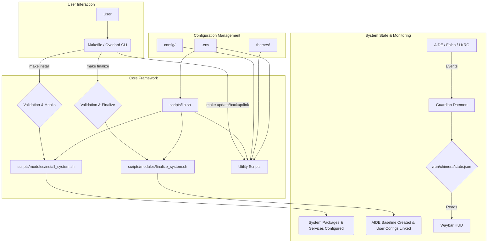

# Diagramma Architetturale di Chimera Guardian Arch

```mermaid
graph TD
    subgraph User Interaction
        A[User] --> B(Makefile / Overlord CLI);
    end

    subgraph Core Framework
        B -- make install --> C{Validation & Hooks};
        C --> D[scripts/modules/install_system.sh];
        B -- make finalize --> E{Validation & Finalize};
        E --> F[scripts/modules/finalize_system.sh];
        B -- make update/backup/link --> G[Utility Scripts];
        H[scripts/lib.sh] --> D & F & G;
    end

    subgraph System State & Monitoring
        D --> I(System Packages & Services Configured);
        F --> J(AIDE Baseline Created & User Configs Linked);
        K[Guardian Daemon] --> L{/run/chimera/state.json};
        L -- Reads --> M[Waybar HUD];
        N[AIDE / Falco / LKRG] -- Events --> K;
    end

    subgraph Configuration Management
        O[config/] & P[themes/] & Q[.env] --> G;
        Q --> H;
    end
```