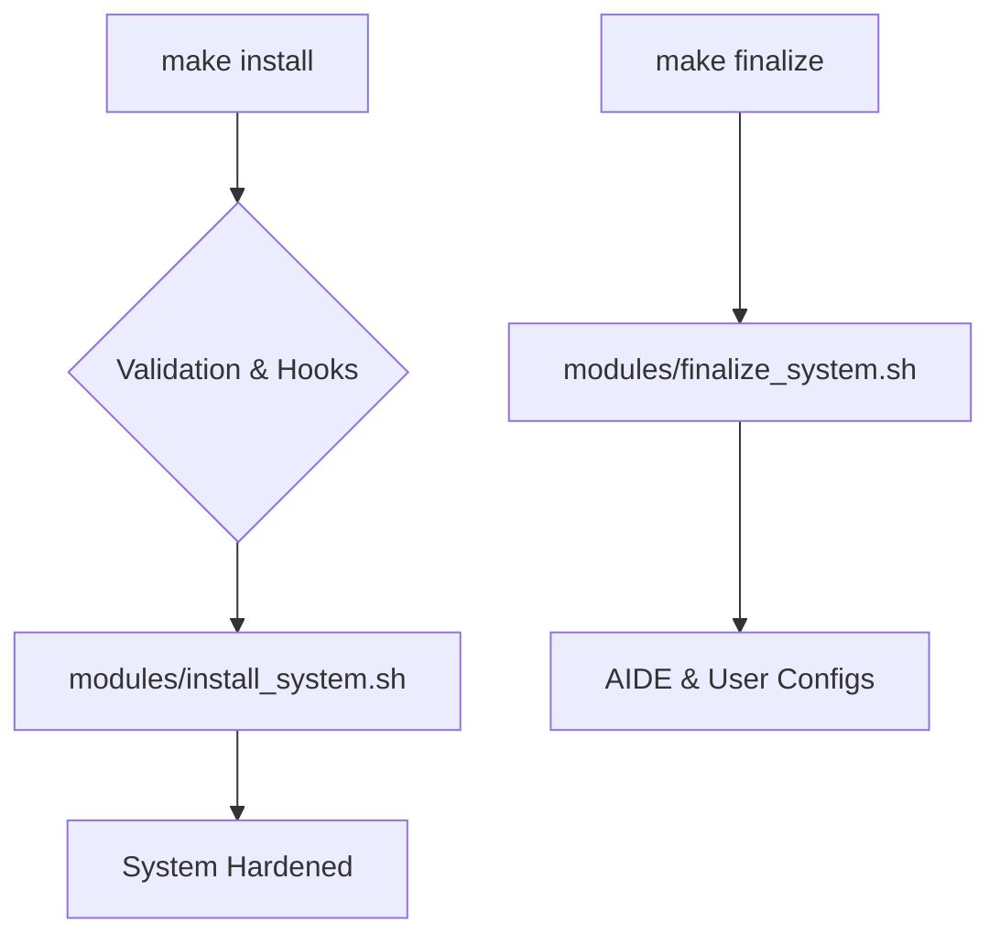

# Panoramica del Sistema: Chimera Guardian Arch

Questo documento fornisce una visione d'insieme completa dell'architettura, del processo di deployment e delle procedure operative standard per la piattaforma Chimera Guardian Arch.

## 1. Architettura Generale

Chimera Guardian Arch è un **framework di post-installazione** che stratifica un ambiente SecureOps su una base Arch Linux minimale e crittografata. È progettato per essere modulare, sicuro e incentrato sul controllo dell'operatore.

**Componenti Chiave:**
* **Sicurezza:** Kernel Hardened, LKRG, AIDE, UFW, OpenSnitch, DNSCrypt, Tor, I2P.
* **Monitoraggio:** Guardian Daemon, Health Check.
* **Automazione:** Makefile, `install.sh`, `lib.sh`, Hooks.
* **UX:** Hyprland, Waybar, Rofi, Kitty, Tematizzazione Dinamica, `zsh_functions`.
* **Compartimentazione:** Profili VM (Disposable, Work, Tor, CyberLab).

Per un'analisi dettagliata, consultare `docs/architecture.md`.

## 2. Processo di Deployment

Il deployment richiede un approccio a più fasi per garantire sicurezza e corretta configurazione.

**Prerequisito:** Un sistema Arch Linux minimale installato su una partizione **crittografata con LUKS**.

**Fasi Principali:**
1.  **Installazione Base Arch:** Utilizzare `archinstall` selezionando il profilo `Minimal` e abilitando la crittografia LUKS.
2.  **Clonazione e Configurazione:** Clonare il repository del framework, copiare `.env.example` in `.env` e personalizzare le variabili (utente, tema).
3.  **Installazione del Framework:** Eseguire `make install`. Questo comando orchestra l'installazione di tutti i pacchetti, la configurazione dei servizi e l'hardening iniziale.
4.  **Configurazione Manuale Critica:** Modificare `/etc/default/grub` (per i parametri del kernel `lsm=...`) e `/etc/fstab` (per le opzioni `noatime, compress=zstd` se si usa BTRFS) come indicato.
5.  **Riavvio.**
6.  **Finalizzazione:** Eseguire `make finalize`. Questo comando completa l'hardening (inizializzazione AIDE) e collega le configurazioni utente tramite symlink.
7.  **Messa in Sicurezza AIDE:** Copiare la baseline AIDE (`/var/lib/aide/aide.db.gz`) su un supporto esterno sicuro.

Per una guida dettagliata passo-passo, fare riferimento a `DEPLOYMENT_CHECKLIST.md`.

## 3. Operazioni Quotidiane e Uso

### 3.1 Centro di Comando (`Makefile` e TUI)
* **Makefile:** L'interfaccia principale per le operazioni di gestione (`make update`, `make backup`, `make healthcheck`, etc.).
* **TUI Control Center:** Avviare con `make tui` per un'interfaccia terminale interattiva per le operazioni più comuni.

### 3.2 Gestione della Postura di Sicurezza (`guardian-cli`)
Utilizzare i comandi rapidi `gdn-*` (definiti in `zsh_functions`) per cambiare il livello di sicurezza:
* `gdn-standard`: Per uso quotidiano, veloce e con DNS sicuro.
* `gdn-secure`: Attiva il proxy Tor/Privoxy per uso selettivo.
* `gdn-paranoid`: Attiva l'anonimato totale con kill switch.
* `gdn-cyberlab`: Profilo ottimizzato per operazioni offensive (disabilita DNSCrypt, MAC spoofing attivo).

### 3.3 Compartimentazione (VMs)
Utilizzare il comando `make vm profile=<nome>` (es. `make vm profile=tor`) per creare VM isolate. Gestire le VM tramite l'applicazione "Gestore Macchine Virtuali" (comando `vms`).

### 3.4 Monitoraggio e Manutenzione
* **Aggiornamenti:** Eseguire `make update` regolarmente.
* **Controllo Integrità:** Eseguire `aide-check` periodicamente.
* **Aggiornamento Baseline AIDE:** Eseguire `aide-update` **dopo ogni** `make update`.
* **Controllo Salute:** Eseguire `make healthcheck` per un report sullo stato di sicurezza.

Per una guida approfondita su ogni funzionalità, consultare `SYSTEM_GUIDE.md`.